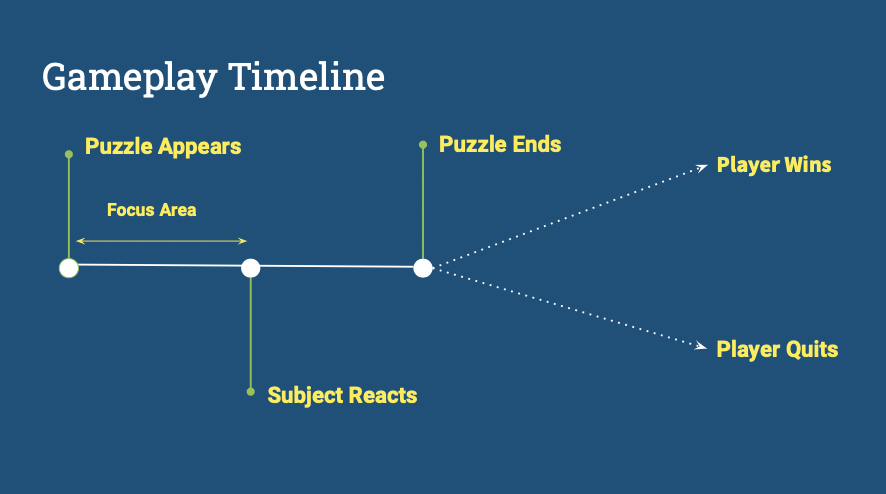
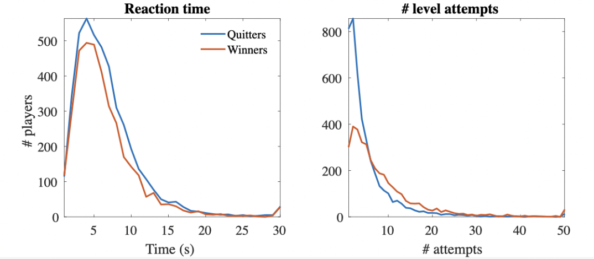

#  How Mind-Wandering Relates to Insight-Based Learning
## Aalia Malik
### Keck Science Summer 2022 

**What is Mind-wandering?**

- Refers to thoughts that arise which are not related to the immediate environment
- Spontaneous internal process that is often unaware
- Has been the subject of numerous studies in the recent years

**Challenges of studying Mind-wandering**

- Internal processes which may be hard to quantify
- Most studies utilize probing techniques or questionnaires 

**Advantages of Hexxed Data**

- Task that require creative insignt
- Standard for modeling
- Large sample size

**Gameplay Timeline**

**Hypothesis**
- How does mind-wandering relate to insight-based learning?
- If players take more time before initial action (mind-wander), they will be more likely to complete the first level.
- Rationale: Time outside the game allows people put aside the task and re-enter the task with a “clean slate”

**Results**
| Reaction time vs. Number of Level Attempts      | Log of Reaction time vs. Number of Level Attempts | Regression of Reaction time vs. Number of Level Attempts     | Mean Reaction Time vs. Number of Level Attempts        |
| :---:        |    :----:   |          :---: |     :---:    |
|            | 2       |       3   |       4      |
| Distributions of the first reaction times and level attempts for winners and quitters    | This is the ‘log’ of the recored values in order to scale the data. This helps to reduce the impact of outliers.       |  Regression to predict the number of attempts for both winners and quitters      |   Quitters spent more time before making a move regardless of how many attempts they required.          |

**Results**
- Results did not support the hypothesis 
- Spending more time off task decreases the likelihood that the player will win
- Possible interpretation: People that beat the game are more focused and those that quit are more discouraged/disinterested

**Discussion**
Overall, it can be concluded that more time off-task during the initial investment stage resulted in more attempts to complete the first level. This contradicted my hypothesis and was the opposite of what was predicted. Spending more time on the game decreases the likelihood that the player will win. 
A possible interpretation of the results may be that those who beat the game are faster and more focused compared to those that might have been disinterested and discouraged, and eventually quit the game. These findings may be applied to strategies for learning by encouraging students to follow their intuition instead of spending time thinking about many choices.  

**Acknowledgements**
Thank you to Professor Agarwal and all of the lab members for their support!

